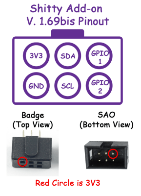
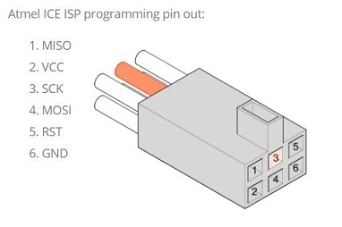

# Bendy SAO Middle build notes

I built another 10 sections of BendySAO by hand, here are my notes.

## Software

 * Added Attiny3224 support using megaTinyCore via [ATTinyCore](https://github.com/SpenceKonde/ATTinyCore)
 * Modifed code to add support for 10 more sections (30 more leds)

## Programming
 * See [Connecting Atmel-ICE to UPDI](https://developerhelp.microchip.com/xwiki/bin/view/software-tools/programmers-and-debuggers/atmel-ice/connecting-to-avr-and-sam-target-devices/updi/)
 * Connect to GPIO2

## Spacers

 * Used openscad design in [spacer](https://github.com/TomKeddie/BendySAO/tree/tomk_files/3rdparty/TomKeddie/spacer) for spacers instead of laser cut acrylic.  I found 1.5mm acrylic a little hard to source.

## Stand

 * The stand I was gifted shrank in the dryer so I created a new one using the openscad design in [stand](https://github.com/TomKeddie/BendySAO/tree/tomk_files/3rdparty/TomKeddie/stand)

## BOM
